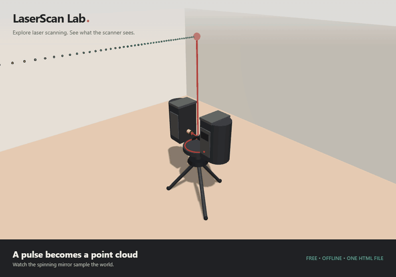

# LaserScan Lab

[](https://github.com/ProfRino/laserscan-lab/actions/workflows/ci.yml)
[](https://github.com/ProfRino/laserscan-lab/releases/latest/download/LaserScan-Lab.html)

Explore laser scanning, point clouds, occlusion and multi-room surveys in your browser.
Try it online or download one HTML file to use offline, with no installation or server.

**[Try it online](https://profrino.github.io/laserscan-lab/)** · **[Download the offline app](https://github.com/ProfRino/laserscan-lab/releases/latest/download/LaserScan-Lab.html)**



> **Educational model:** this application demonstrates scanning principles. It is not a calibrated instrument simulator or a real ICP registration solver.

## Project lead

<a href="https://github.com/ProfRino">
  <br>
  <strong>Prof Rino Lovreglio</strong>
</a><br>
Massey University

## Features

* **How a scanner works.** Four animated steps explain the spinning mirror, round-trip time of flight, vertical profiles and horizontal rotation.
* **Four room scenarios.** Explore an empty room, structural columns, a furnished office, or two rooms connected by a corridor.
* **Six guided lessons.** Investigate resolution, noise, occlusion, placement, reference targets and a three-scan survey.
* **Interactive settings.** Change horizontal and vertical sampling, range, range noise, incidence cutoff, vertical field of view and scanner height.
* **Occlusion and blind spots.** Walls, columns, boxes, table tops and target spheres produce nearest-surface returns and scan shadows. Moving a station changes what it can see.
* **Multiple stations.** Position up to three tripods, color returns by station, compare room-shell visibility and overlap, and inspect shared targets for each station pair.
* **Three-scan survey.** The multi-room lesson scans the left room, corridor, and right room in sequence. Three widely spaced floor balls at each doorway link adjacent scans. Previous clouds remain unchanged. There are no artificial offsets or manual alignment exercises.
* **Point-cloud display.** Switch between orbit, top and scanner views; hide solid geometry; color points by range, incidence, station or a single color; highlight potential coverage gaps.
* **XYZ export.** Download completed clouds as ASCII `x y z r g b`, with coordinates in metres, Y up, and RGB values from 0 to 255. Storage is capped at 1,200,000 points.
* **Offline delivery.** All runtime code is bundled locally. The downloadable application makes no HTTP requests.

## How to use it

### Download and double-click

1. Download **[LaserScan-Lab.html](https://github.com/ProfRino/laserscan-lab/releases/latest/download/LaserScan-Lab.html)** and save it on your computer.
2. Double-click the file to open it in a browser with JavaScript and WebGL enabled.
3. Follow **How it works**, then switch to **Room scan** and try the lessons.

The download is a release attachment that saves the file instead of displaying its source code. You can also download the repository ZIP and open `LaserScan-Lab.html` from the extracted folder. The development entry point, `index.html`, requires the optional developer server. The standalone file does not.

### Controls

| Action | Control |
| --- | --- |
| Orbit | Drag empty space |
| Pan | Right-drag; in Top view, drag empty space |
| Zoom | Mouse wheel; two-finger pinch on touch screens |
| Move a station or obstacle | Drag the tripod or object |
| Touch navigation | One finger to orbit, two fingers to pan and zoom |
| Show mobile controls | Use the menu button |

Changes invalidate the previous cloud. Enable **Auto-rescan on change** to rebuild it automatically, or press **Scan** when ready. A scanner origin placed inside an obstacle is rejected with a message.

## Teaching sequence

1. **Time of flight:** explain why distance is half the speed of light multiplied by round-trip time.
2. **Resolution:** halve both angular steps and compare the increase in emitted samples.
3. **Noise:** compare zero noise with exaggerated range noise on a flat wall.
4. **Occlusion:** identify missing surfaces behind a wall and beneath a table. Explain why finer sampling cannot recover a blocked view.
5. **Placement:** add a station on the other side of an obstruction and compare visibility and overlap.
6. **Registration:** scan room 1, the corridor, and room 2 in sequence. Verify the target links connect 1 to 2 to 3, even without direct overlap between 1 and 3.

See **[TRAINING.md](TRAINING.md)** for facilitator notes, expected observations and assessment suggestions.

## Model limitations

* Geometry uses single nearest returns from axis-aligned boxes, cylinders, spheres and the room shell. Stations are sequential positions of one scanner, so they do not occlude each other.
* Noise is random Gaussian range error scaled by distance and incidence. Grazing returns have probabilistic dropout. Reflectivity, glass transmission, mixed pixels, multipath and atmospheric effects are not modeled.
* Coverage estimates geometric visibility on a 0.5 m grid over the outer room shell. It does not measure actual point density, furniture coverage or internal-wall surface area.
* Shared targets indicate center-line visibility, not successful sphere fitting or registration quality. Each target-based registration link needs sufficient non-collinear targets.
* The lesson demonstrates reference-target correspondence using known simulated coordinates. It does not implement sphere fitting or a registration solver.
* A capped cloud can underrepresent later stations. Partial scans and unfinished surveys cannot be exported.

## For developers

Use Node.js 22 or newer:

```sh
git clone https://github.com/ProfRino/laserscan-lab.git
cd laserscan-lab
npm ci
npm start
npm run build
npx playwright install chromium
npm test
```

`npm start` launches an optional development server. `npm run build` regenerates the offline HTML and creates `dist/` for optional web hosting.

To recreate the README animation, run `node scripts/record-demo.cjs`, then `python scripts/encode-demo.py` (Pillow required). The recording uses the real application with presentation captions; the controls are hidden only in the recording.

The GitHub Actions validation workflow builds the application and runs browser and geometry tests. Tests include direct file loading with networking disabled, all scenes and lessons, occlusion cases, export, resource disposal, the point cap and responsive layouts. See **[VALIDATION.md](VALIDATION.md)** for scope and platform limits.

```text
LaserScan-Lab.html        Ready-to-open offline application
index.html               Development UI and teaching content
src/app.js               Rendering, scan engine, controls and lessons
src/intersections.js     Analytic ray/solid intersections
src/styles.css           Responsive interface styles
scripts/standalone.cjs   Single-file packaging and syntax validation
tests/                   Browser and geometry regression tests
assets/demo.gif          Application screenshot
.github/workflows/       Validation and optional Pages deployment
```

GitHub Pages publishes the app automatically when `main` is updated. The downloaded HTML remains fully offline.

## Stack

[Three.js](https://threejs.org/) r128 for rendering, [Vite](https://vite.dev/) for bundling, and [Playwright](https://playwright.dev/) for automated checks. Only the bundled application is needed by learners.

## Citation

If you reference this work, please cite:

> Lovreglio, R. *LaserScan Lab*. Massey University.
> https://github.com/ProfRino/laserscan-lab

A machine-readable [`CITATION.cff`](CITATION.cff) is included for GitHub's **Cite this repository** feature.

## License

A project license has not yet been selected. Bundled Three.js retains its MIT license; see [THIRD_PARTY_NOTICES.txt](THIRD_PARTY_NOTICES.txt). Its notice is also embedded in the standalone HTML.

